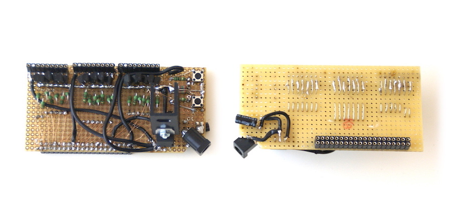

# Counter
This document describes how to setup, use, configure the 3 segment counter display and what to watch out for when handling the device and packing up for transportation.

For ***setup*** the display panels need to be connected to the control board and 12v 1.5amp power connected to the control board.

To ***use*** there are two buttons, go/pause and reset, on the control board.  

To ***configure*** find the wifi network and wireless control web interface. This is only needed if the starting number (0 by default) and number counted up to (630 by default) need to be changed.

For ***handling*** this document describes some things to be careful about when packing up.

                

# Setup

### Connect display panels

The control board has 3 connectors for the separate display panels. On the back of each panel is an arrow indicating which edge of the panel should be pointing up.

Each panel displays one digit from a complete number. To make certain the 1's,
10's and 100's digits are shown in their proper location connect each panel in
the order shown above. When power is connected to the control board and the device starts a display
test sequence is run that helps confirm that the segments are setup in the
proper orientation. See the Test Display Sequence section for details.

The display cables are keyed so that they can only be connected to the panel and control
board in one orientation, as shown in the pictures below. Notice that on the cables one pin is missing, and the connectors on the control board have one hole filled in. This makes certain the cable can only be connected in one orientation. Connect gently as they could break if forced.

 

 
 

### Connect DC power

The board is powered with a standard 12V 1.5amp power cable. The supplied DC cable
is sufficient but if in the future the cable must be replaced (if it were lost)
the inner pole of the cable is the 12V+ and the outer is ground.

### Connect Battery power
Alternatively you can also use a 12V battery. The supplied lead acid 12V 2000mAh battery provides full power with all LED's on for 45 minutes or more. 

To recharge the battery use a lead acid battery charger such as the one supplied with the battery. Connect it to the charger in the manner shown below with the "+" cable connector of the battery attached to the red charger clamp and the "-" cable connector to the black clamp.

 

 

     

# Use
When the device is powered on it will first do the Test Display Sequence. After this the display will be blank and ready for counting up. The buttons can be used to start counting, pause or reset the counter.

 

 

     

# Configure

The wireless control panel can be used to configure the settings of the device. To access this interface use a computer or phone and join the Wifi network called "**192.168.6.1**"
with the password "**upandover**". It may take up to 60 seconds from when the
power is connected to the control board for this network to appear. Once connected to the wireless network access the control interface at http://192.168.6.1 using a web browser.

The interface provides buttons that control the counter a similar way to the physical control buttons. However, from this interface you can also configure the counter settings.

* **Start Count** - this is the number the counter will show before counting. If it is set to "0" that would mean that after reset the counter would first be blank, then after pressing the Go button it will show "0" and then wait. And then after pressing the Go button again it will start counting from 1.
* **Stop count** - this is what the counter counts up to.
* **When finished show** - this number or 3 character text (such as "FIN") will be shown on the display for a number of seconds also configured in the "**leave up for**" input box. After this time has elapsed the display will go to blank, showing nothing.

                      

# Test Display Sequence

This sequence is used to confirm the display is physically setup and connected in the proper order and that none of the display segments are damaged or broken. This sequence is run during the power on of the device or it can be initiated from a button on the Wifi wireless control panel. The sequence steps are as follows:

1. Turn on each segment on each panel in sequence. Starting from the left most panel (the 100's digit). Each should light up individually. If two light up at once there is a short in the wiring and may require re-soldering.  
   
2. Turn on all segments (number "888") to confirm all segments are working.  
   
3. Show a rectangle. The left most segment should show "[" and the right most should show "]". This helps determine orientation of digits.  
   
4. Show "123". This also helps determine orientation.  
   

        

# Handling

* Be careful with the display cables. They are hand made.
* Be careful with the top of the control board when packing up. The very thin wires (that look like copper and can be barely seen in the image below) are the one part I worry about coming loose. So if possible package and store or carry the control board in a way that nothing else is resting on top of it.

My suggestion is to pack the components in the box with the display pannels on the bottom first, then put the power cable in a bag or box on top, and put the control board on the other end of the box. Then pack the box with some foam or paper so that things do not move around. Idealy try to keep things from being placed on top of the control board.

   

### Trouble Log

To give an idea of the possible causes in the event that the a segment or display panel stops working here is a log of the problems I ran into during testing and how I resolved them. This is useful for someone that wants to troubleshoot problems and repare on their own. For this a multimeter and soldering iron would be needed (each under 10EU).

* One segment in one display wasn't working...  
  Because the heat sync (large U shaped black metal thing attached with a nut+bolt to the chip next to the power connector) was bent down far enough that it was touched one of the little green resistors on the board. It was bent during packing and transportation due to something resting on top of it in the packed box. To resolve I added something under the heat sync to hopefully keep it from bending down that far.
* One segment in one display wasn't working...  
  Because one of the small copper colored wires disconnected. These wires are the thinest wires found on the board. There are 23 of them (1 for each of the 7 segments in the 3 display panels, as well as 2 for the buttons). They connect to the 40 pin connector on the bottom that plugs into the Raspberry Pi. To figure out that the wire was disconnected I inspected visually all the wires, tapped each one lightly with a pen to see if the connection was loose. After discovering the loose wire I resoldered that wire.
* Two segments in one display were lighting up at the same time...   
  Because one of the wires of the connector cable was touching another wire this caused two segments to light up when only one was intended. That meant that when the device wanted to show a "1" it would look like a "7" instead. To discover the problem of the wires touching eachother I visually inspected the cable connectors very closely. I found that a very tiny thread of a wire from one pin was touching it's neighboring pin. This can be fixed by cutting away that part so that they are seperated or by resoldering the wires so that they do not touch.
