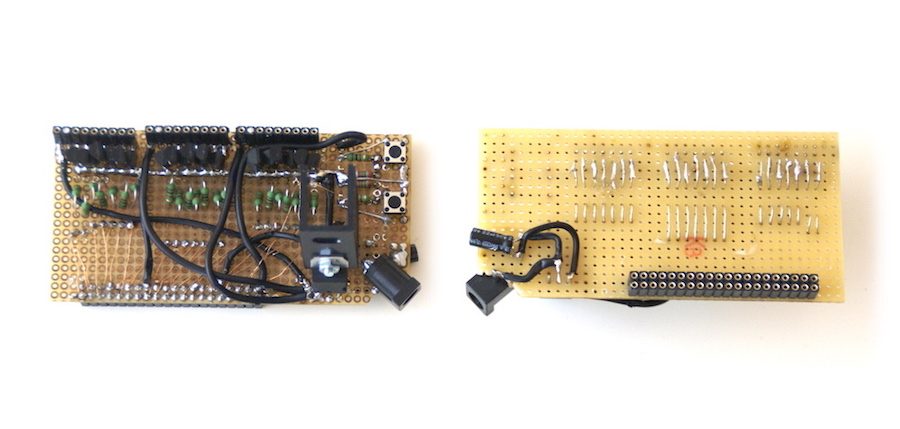

Counter
-------

This is a home made 3 digit LED display made for a performance in Helsinki
by [Harriet Rabe](https://harrietrabe.com). The code currently just counts from 0 to 630 but could be modified to display any 3 characters or digits that would fit in 3 7-segment display panels. This repository contains the code to be run on a RaspberryPi and enough information to reproduce the hardware. It was put together in a rush so some details may be missing but please feel free to contact me [nathan@squimp.com](mailto:nathan@squimp.com) with questions.

Hardware
--------

The panels are strips cut from a 12V 5m LED light strip. See the Bill of Materials file for complete details of components that make up the control board. A control board was made to switch each segment of the panel on and off. See the Control User Manual for detailed images that may help with building. The design is a mix between a [instructable](http://www.instructables.com/id/Giant-Two-Digit-Countdown-Clock/) and [sparkfun](https://www.sparkfun.com/tutorials/47) projects. The total cost was <200EU but could probably be built for around 100EU. The build time was about a week off and on.

Software
--------

The software should be installed on a RaspberryPi. See the Control User Manual for details of how the software works and what features it currently provides.

RaspberryPi only requires the WiringPi library for basic functions (heavy use of the shell ``gpio`` command that it provides). To use the wireless configuration interface you will need a wireless card on the RaspberryPi or a RaspberryPi 3 that comes with a wifi card already, and you would need to install ``python-webpy dnsmasq hotspotd``.

After dependencies are installed you copy the software and start everything with the ``run.sh`` script. Add this to ``/etc/rc.local`` if you want the software to start on boot.

Testing
-------
To test locally (on a Linux, Unix or OSX workstation)

Setup:

    pip install webpy

Run:    

    export DEBUG=1
    bash software/countup.sh

Optionally in another terminal you can run the control web server to modify configuration:

    export DEBUG=1
    python2 software/server.py
    # open http://localhost:8080

License
-------

License: Non-White-Heterosexual-Male

If you are not a white heterosexual male you are permitted to copy, sell and use
this work in any manner you choose without need to include any attribution you
do not see fit. You are asked as a courtesy to retain this license in any
derivatives but you are not required. If you are a white heterosexual male you
are provided the same permissions (reuse, modification, resale) but are
required to include this license in any documentation and any public facing
derivative. You are also required to include attribution to the original author
or to an author responsible for redistribution of a derivative.

http://nonwhiteheterosexualmalelicense.org
